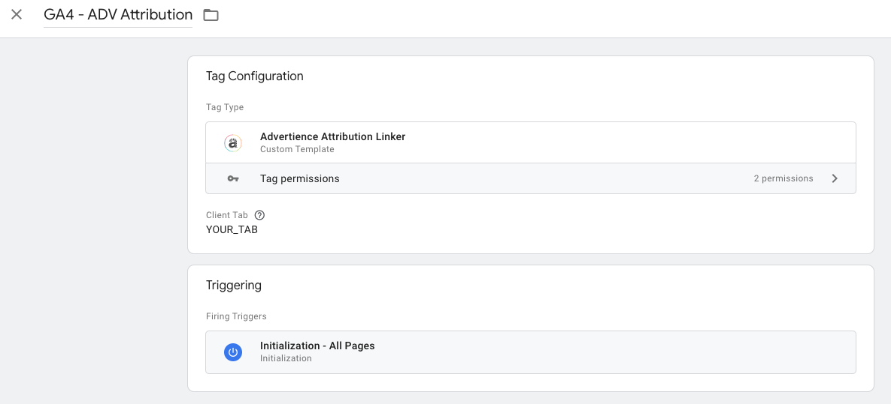
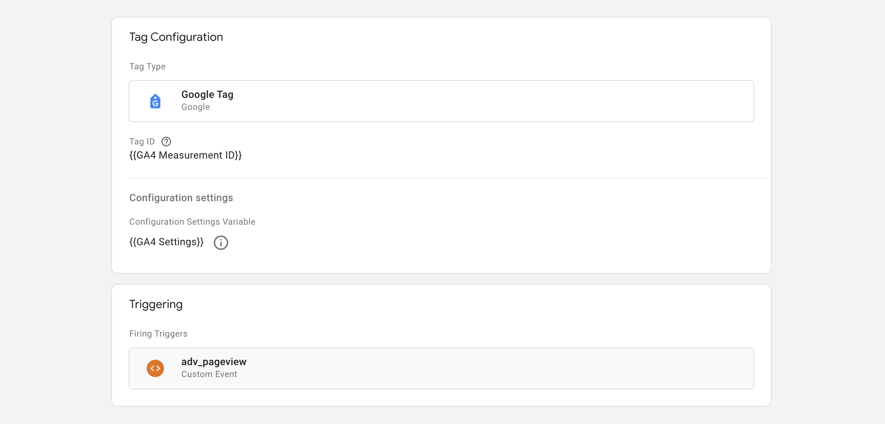

# Helio Attribution Linker Tag

Helio Attribution Linker provides simple integration with the Helio Attribution Solution.

Control attribution to reflect the right channels to accurately measure success.

## Setup

This tag will add three variables to the dataLayer: `source`, `medium`, and `campaign`. It will fire the `helio_pageview` event when finished. These variables will be used to control attribution. Here is how to configure your GTM container to make the most of this tag.

### 1. Add the Helio Attribution Linker tag

- Navigate to `Tags`
- Create a new tag
- Choose `Helio Attribution Linker` configuration from the Community Template Gallery
- In `Client Tab`, write your Helio Attribution client tab name
- To use the attribution on all pages, it is recommended you use the `Initialization - All Pages` trigger. Otherwise create a new trigger that fires on page view of the pages you want them to
- Save the tag

### 2. Make your three dataLayer variables

You will need to create a variable for each of `source`, `medium`, and `campaign`.

- Navigate to `Variables`
- Create new variable, named with `source`, `medium`, or `campaign`
- Choose `Data Layer Variable` configuration
- In `Data Layer Variable Name`, write the appropriate choice of `source`, `medium`, or `campaign`
- Save the variable and repeat until all three variables are created

### 3. Make your GA4 Settings variable

Using your three dataLayer variables, you will create a variable that you will use with your Google Tag.

- Navigate to `Variables`
- Create new variable, named `GA4 Settings`
- Choose `Google Analytics Settings` for the Variable Type
- Under `Config Parameter`, add 4 parameters
    - `campaign_source`: Set the value to `{{Source}}` by typing that or clicking the `+` icon on the right and selecting your `Source variable`
    - `campaign_medium`: Same as with Source, but enter `{{Medium}}` instead
    - `campaign_name`: Same as with Source, but enter `{{Campaign}}` instead
    - `send_page_view`: Set the value to true
- Save the variable

### 4. Create `helio_pageview` custom event

- Navigate to `Triggers`
- Create new trigger, named `helio_pageview` to avoid confusion
- Choose `Custom Event` configuration
- In `Event name`, write `helio_pageview`
- Save the trigger

### 5. Set your GA4 Configuration tag

- Navigate to `Tags`
- Click on your container's Google tag
- Change the trigger to `helio_pageview`
- Open the `Configuration settings` section
- Set the Configuration Settings Variable to the `{{GA4 Settings}}` from step 3
- Save the tag

After these steps have been taken, the Google tag will fire with the proper fields being set with the proper values.

How it works is that when the `helio_pageview` event is fired, the Google tag will fire and update the appropriate campaign parameters to be used by future GA4 event tags. This means that if you want a GA4 event tag that fires on page view to use the attribution, you must add the `helio_pageview` trigger to it rather than the usual `All Pages` trigger. This could be especially important for those tracking purchases.

It is recommended you test the setup in preview mode to ensure it is working as expected.